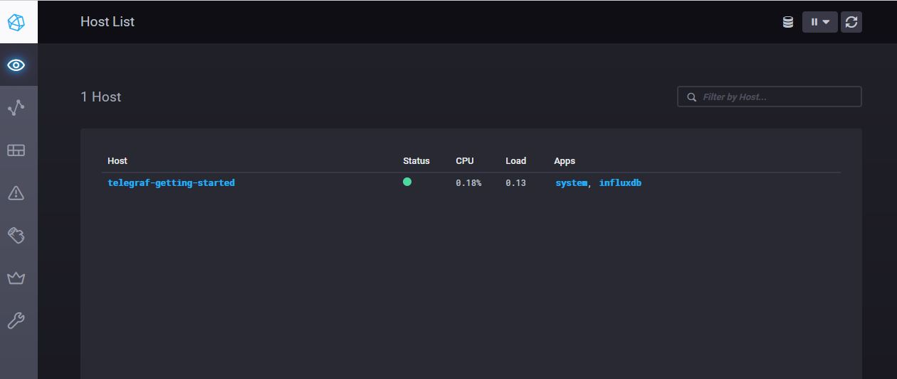
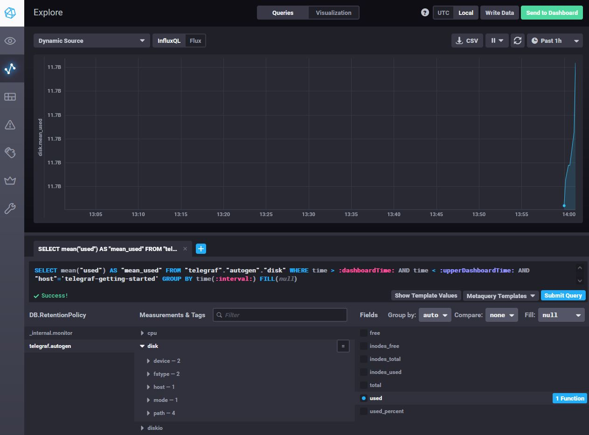
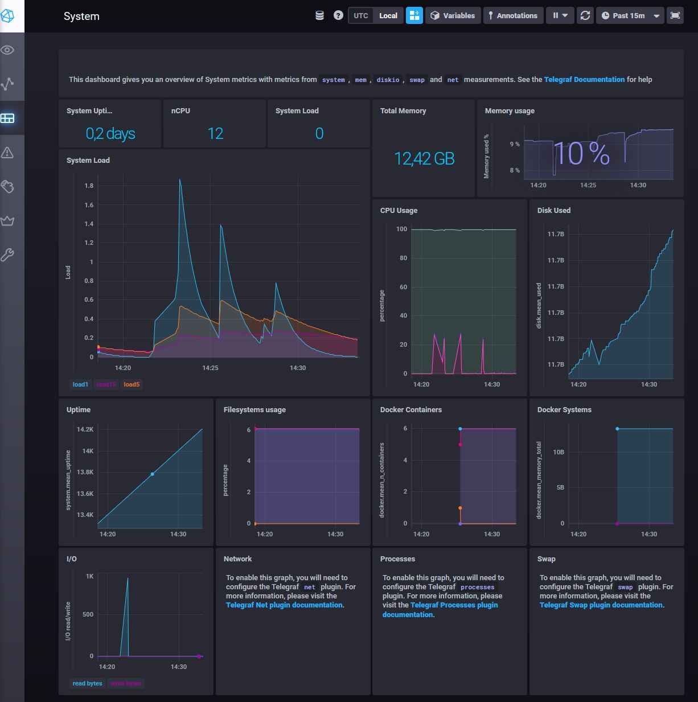

# Домашнее задание к занятию "10.02. Системы мониторинга"

## Обязательные задания

1. Опишите основные плюсы и минусы pull и push систем мониторинга.

2. Какие из ниже перечисленных систем относятся к push модели, а какие к pull? А может есть гибридные?

    - Prometheus 
    - TICK
    - Zabbix
    - VictoriaMetrics
    - Nagios

3. Склонируйте себе [репозиторий](https://github.com/influxdata/sandbox/tree/master) и запустите TICK-стэк, 
используя технологии docker и docker-compose.

В виде решения на это упражнение приведите выводы команд с вашего компьютера (виртуальной машины):

    - curl http://localhost:8086/ping
    - curl http://localhost:8888
    - curl http://localhost:9092/kapacitor/v1/ping

А также скриншот веб-интерфейса ПО chronograf (`http://localhost:8888`). 

P.S.: если при запуске некоторые контейнеры будут падать с ошибкой - проставьте им режим `Z`, например
`./data:/var/lib:Z`

4. Перейдите в веб-интерфейс Chronograf (`http://localhost:8888`) и откройте вкладку `Data explorer`.

    - Нажмите на кнопку `Add a query`
    - Изучите вывод интерфейса и выберите БД `telegraf.autogen`
    - В `measurments` выберите mem->host->telegraf_container_id , а в `fields` выберите used_percent. 
    Внизу появится график утилизации оперативной памяти в контейнере telegraf.
    - Вверху вы можете увидеть запрос, аналогичный SQL-синтаксису. 
    Поэкспериментируйте с запросом, попробуйте изменить группировку и интервал наблюдений.

Для выполнения задания приведите скриншот с отображением метрик утилизации места на диске 
(disk->host->telegraf_container_id) из веб-интерфейса.

5. Изучите список [telegraf inputs](https://github.com/influxdata/telegraf/tree/master/plugins/inputs). 
Добавьте в конфигурацию telegraf следующий плагин - [docker](https://github.com/influxdata/telegraf/tree/master/plugins/inputs/docker):
```
[[inputs.docker]]
  endpoint = "unix:///var/run/docker.sock"
```

Дополнительно вам может потребоваться донастройка контейнера telegraf в `docker-compose.yml` дополнительного volume и 
режима privileged:
```
  telegraf:
    image: telegraf:1.4.0
    privileged: true
    volumes:
      - ./etc/telegraf.conf:/etc/telegraf/telegraf.conf:Z
      - /var/run/docker.sock:/var/run/docker.sock:Z
    links:
      - influxdb
    ports:
      - "8092:8092/udp"
      - "8094:8094"
      - "8125:8125/udp"
```

После настройке перезапустите telegraf, обновите веб интерфейс и приведите скриншотом список `measurments` в 
веб-интерфейсе базы telegraf.autogen . Там должны появиться метрики, связанные с docker.

Факультативно можете изучить какие метрики собирает telegraf после выполнения данного задания.

## Дополнительное задание (со звездочкой*) - необязательно к выполнению

В веб-интерфейсе откройте вкладку `Dashboards`. Попробуйте создать свой dashboard с отображением:

    - утилизации ЦПУ
    - количества использованного RAM
    - утилизации пространства на дисках
    - количество поднятых контейнеров
    - аптайм
    - ...
    - фантазируйте)
    
___
## Выполнение ДЗ:

## Обязательные задания

1. Основные плюсы и минусы pull и push систем мониторинга:

Основные плюсы push-модели:
- Возможность настройки на агентах куда передавать данные - на центральный сервер, реплику или же в другие системы мониторинга
- Настройка на агенте какие метрики нужно отправлять и с какой периодичностью на сервер
- Удобно при использовании агентов с динамическими IP-адресами. Нет необходимости контролировать изменения IP-адресов
- Отсутсвие в некотором роде нагрузки на централизованный сервер в плане "работы" с агентами. Он просто ожидает получения данных от агентов и занимается хранением в БД.

Основные плюсы pull-модели:
- Настрйока и контроль опроса только нужных агентов со стороны централизованного сервера
- Возможность организовать безопасный канал связи перед тем, как "забирать" метрики с агентов. Например, установка туннеля с TLS.
- Возможность опроса агентов не только одной системой мониторинга, но и отправить запрос с помощью другого ПО
- Отсутсвие проблем связанных с NAT, так как сервер является инициатором соединения
- Сервер сам забирает данные с агентов в своё порядке, тем самым не создавая высокую нагрузку на сеть и сервер в определенный момент времени.

Основные минусы push-модели:
- Все агенты могут в один момент времени отправлять данные в централизованную систему, что может создать высокую нагрузку на сетевой трафик и на сам сервер в определенный момент времени. Это можно решить с помощью доп. сервиса в виде очередей.
- Если изменится IP-адрес или доменное имя централизованного сервера, то небходимо будет менять настройки на каждом агенте
- Единая точка отказа в виде централизованного сервера, если в один момент времени он будет недоступен, то ряд информации с нескольких узлов может не прийти
- Если передача данных осуществляется от агентов по незащищенному каналу, то есть шанс утечки данных
- В случае необходимости изменения частоты опроса или же других метрик, то придется перенастраивать каждого агента
- Возможные проблемы связанные с NAT, когда клиент не сможет "достучаться" до сервера

Основные минусы pull-модели:
- Центральный сервер должен знать все адреса агентов. Соответственно, каждый новый агент - необходимо прописывать на центральном сервере. Если IP-адрес изменится, то необходимо переобновлять конфигурацию на центральном сервере.
- Единая точка отказа - если с сервером что-то случится, то он не сможет опросить агентов за время простоя.

2. Какие из ниже перечисленных систем относятся к push модели, а какие к pull? А может есть гибридные?

    - Prometheus - в каком-то роде это гибридная система мониторинга, но приоритетно это pull-модель. Push-моделью система может стать благодаря дополнительному сервису Pushgateway, который будет принимать информацию с агентов. А Prometheus забирает с него данные по pull-модели.
    - TICK - это push-модель мониторинга. Агенты (Telegraf) собирают данные с хост-машин и отправляют в TSDB (InfluxDB). Агенты Telegraf также могут работать с pull-моделями.
    - Zabbix - гибридная система мониторинга. Умееть работать как с push, так и сpull моделями. 
    Push-модель заключается в "Активных проверках" - когда определенные данные постоянно поступают от агента к серверу.
    Pull-модель заключается в "Пассивных проверках" - когда данные накапливаются на агентах и при необходимости, забираются сервером.
    - VictoriaMetrics - Насколько я понял, это просто высокпроизводительня TSDB, в которую можно уже складывать данные из других систем, например, из Prometheus (поддержкая языка запросов PromQL). Думаю, что тут можно назвать эту ДБ как push-модель, в которую "вливаются" данные.
    - Nagios - в каком-то роде это гибридная модель мониторинга. Так как имеются два режима работы - "Активная проверка" и "Пассивная проверка". При "Активной проверке" процесс со стороны сервера устанавливает соединение с хостами и сообщает, что нужно собирать (push-модель). Далее эти данные возвращаются обратно демону Nagios.
    При "Пассивной проверке" - агенты на хостах собирают все данные и ожидают, когда демон Nagios считает их (pull-модель)

3. Репозиторий склонирован. 

Запуск `./sandbox up`выдает ошибку запуска и не может найти dockerfile. Пришлось вручную поменять файл `docker-compose.yml`, добавив в поле `dockerfile: ./latest/Dockerfile` принудительно, без указания переменных. А также в каждой папке с `images` принудительно прописать версию образа `FROM X:latest`

После этого командами `docker-compose build` и `docker-compose up` удалось всё поднять.

- Результат `curl http://localhost:8086/ping` :
  
      curl http://localhost:8086/ping -v
      *   Trying 127.0.0.1:8086...
      * TCP_NODELAY set
      * Connected to localhost (127.0.0.1) port 8086 (#0)
      > GET /ping HTTP/1.1
      > Host: localhost:8086
      > User-Agent: curl/7.68.0
      > Accept: */*
      >
      * Mark bundle as not supporting multiuse
      < HTTP/1.1 204 No Content
      < Content-Type: application/json
      < Request-Id: 3af53cd6-3fb4-11ec-80f8-0242ac140003
      < X-Influxdb-Build: OSS
      < X-Influxdb-Version: 1.8.10
      < X-Request-Id: 3af53cd6-3fb4-11ec-80f8-0242ac140003
      < Date: Sun, 07 Nov 2021 10:19:45 GMT
      <
      * Connection #0 to host localhost left intact
- Результат `http://localhost:8888` :
  
      curl http://localhost:8888 -v
      *   Trying 127.0.0.1:8888...
      * TCP_NODELAY set
      * Connected to localhost (127.0.0.1) port 8888 (#0)
      > GET / HTTP/1.1
      > Host: localhost:8888
      > User-Agent: curl/7.68.0
      > Accept: */*
      >
      * Mark bundle as not supporting multiuse
      < HTTP/1.1 200 OK
      < Accept-Ranges: bytes
      < Cache-Control: public, max-age=3600
      < Content-Length: 336
      < Content-Security-Policy: script-src 'self'; object-src 'self'
      < Content-Type: text/html; charset=utf-8
      < Etag: "336820331"
      < Last-Modified: Fri, 08 Oct 2021 20:33:01 GMT
      < Vary: Accept-Encoding
      < X-Chronograf-Version: 1.9.1
      < X-Content-Type-Options: nosniff
      < X-Frame-Options: SAMEORIGIN
      < X-Xss-Protection: 1; mode=block
      < Date: Sun, 07 Nov 2021 10:21:13 GMT
      <
      * Connection #0 to host localhost left intact
      <!DOCTYPE html><html><head><meta http-equiv="Content-type" content="text/html; charset=utf-8"><title>Chronograf</title><link rel="icon shortcut" href="/favicon.fa749080.ico"><link 
      rel="stylesheet" href="/src.3dbae016.css"></head><body> <div id="react-root" data-basepath=""></div> <script src="/src.fab22342.js"></script> </body></html
- Результат `http://localhost:9092/kapacitor/v1/ping` :
  
      curl http://localhost:9092/kapacitor/v1/ping -v
      *   Trying 127.0.0.1:9092...
      * TCP_NODELAY set
      * Connected to localhost (127.0.0.1) port 9092 (#0)
      > GET /kapacitor/v1/ping HTTP/1.1
      > Host: localhost:9092
      > User-Agent: curl/7.68.0
      > Accept: */*
      >
      * Mark bundle as not supporting multiuse
      < HTTP/1.1 204 No Content
      < Content-Type: application/json; charset=utf-8
      < Request-Id: 8bfbad85-3fb4-11ec-8106-000000000000
      < X-Kapacitor-Version: 1.6.2
      < Date: Sun, 07 Nov 2021 10:22:01 GMT
      <
      * Connection #0 to host localhost left intact

Скриншот WEB-интерфейса `Chronograf` на `http://localhost:8888`:



1. Настройка WEB-интерфейса `Chronograf` (`http://localhost:8888`):

Для того, чтобы отображались поля в WEB-интерфейсе с `memory` и `disk` необходио в файл конфигурации `telegraf.conf` добавить следующее:

      [[inputs.disk]]
        ignore_fs = ["tmpfs", "devtmpfs", "devfs", "iso9660", "overlay", "aufs", "squashfs"]
      [[inputs.mem]]

После перезапуска docker-compose, добавим появившиеся поля:

Перейти в Explore -> `Add a query` -> Выбрать DB `telegraf.autogen` -> В поле `Measurments & Tags` выбрать раздел `Mem` -> Host `telegraf-getting-started` -> В поле `Fields` выбрать `used_percent`.

Появился SQL-запрос:

      SELECT mean("used_percent") AS "mean_used_percent" FROM "telegraf"."autogen"."mem" WHERE time > :dashboardTime: AND time < :upperDashboardTime: AND "host"='telegraf-getting-started' GROUP BY time(:interval:) FILL(null)

Добавим отображение метрики утилизации места на диске (`disk`):

      SELECT mean("used") AS "mean_used" FROM "telegraf"."autogen"."disk" WHERE time > :dashboardTime: AND time < :upperDashboardTime: AND "host"='telegraf-getting-started' GROUP BY time(:interval:) FILL(null)



5. Добавление в конфигурацию telegraf плагина docker:

В файл конфигурации `telegraf.conf` добавлено следующее:

      [[inputs.docker]]
        endpoint = "unix:///var/run/docker.sock"
        docker_label_include = [] 
        docker_label_exclude = [] 

В файл `docker-compose.yml` внесены исправления:

    privileged: true
    volumes:
      # Mount for telegraf configuration
      - ./telegraf/telegraf.conf:/etc/telegraf/telegraf.conf:Z
      # Mount for Docker API access
      - /var/run/docker.sock:/var/run/docker.sock
    ports:
      - "8092:8092/udp"
      - "8094:8094"
      - "8125:8125/udp"
    depends_on:
      - influxdb

Также дополнительно потребовалось дать права на запуск `docker.sock` в системе:

`sudo chmod 666 /var/run/docker.sock`

После этого добавлены метрики для `docker`:

      SELECT mean("n_containers") AS "mean_n_containers", mean("n_containers_paused") AS "mean_n_containers_paused", mean("n_containers_running") AS "mean_n_containers_running", mean("n_containers_stopped") AS "mean_n_containers_stopped" FROM "telegraf"."autogen"."docker" WHERE time > :dashboardTime: AND time < :upperDashboardTime: AND "host"='telegraf-getting-started' GROUP BY time(:interval:) FILL(null)

      SELECT mean("n_cpus") AS "mean_n_cpus", mean("memory_total") AS "mean_memory_total" FROM "telegraf"."autogen"."docker" WHERE time > :dashboardTime: AND time < :upperDashboardTime: AND "host"='telegraf-getting-started' GROUP BY time(:interval:) FILL(null)
___
## Дополнительное задание (со звездочкой*) - необязательно к выполнению

В WEB-интерфейсе в `Dashboards` добавлены разные метрики для отображения, в том числе и те, что создавались выше по заданию:

