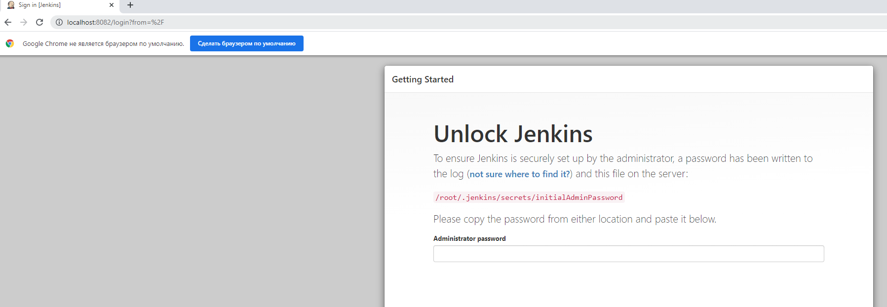

## Домашнее задание к занятию "5.4. Практические навыки работы с Docker"
___
**Задача 1**

В данном задании вы научитесь изменять существующие Dockerfile, адаптируя их под нужный инфраструктурный стек.

Измените базовый образ предложенного Dockerfile на Arch Linux c сохранением его функциональности.

    FROM ubuntu:latest
    
    RUN apt-get update && \
        apt-get install -y software-properties-common && \
        add-apt-repository ppa:vincent-c/ponysay && \
        apt-get update
     
    RUN apt-get install -y ponysay
    
    ENTRYPOINT ["/usr/bin/ponysay"]
    CMD ["Hey, netology”]

Для получения зачета, вам необходимо предоставить:

- Написанный вами Dockerfile 
- Скриншот вывода командной строки после запуска контейнера из вашего базового образа
- Ссылку на образ в вашем хранилище docker-hub
___
**Выполнение ДЗ:**
1. Составлен Dockerfile для ArchLinux:
   
        FROM archlinux:latest
        
        RUN pacman -Sy && \
        pacman -S --noconfirm community/ponysay
        
        ENTRYPOINT ["/usr/bin/ponysay"]
        CMD ["Hey, netology”]
2. Процесс создания образа:
   
   **root@vagrant:/home/vagrant/docker1# docker build -t archlinux1 .**
        
        Sending build context to Docker daemon  2.048kB
        Step 1/4 : FROM archlinux:latest
         ---> 1f90233ad36d
        Step 2/4 : RUN pacman -Sy && pacman -S --noconfirm community/ponysay
         ---> Running in 4d1e6fba99ec
        :: Synchronizing package databases...
         core downloading...
         extra downloading...
         community downloading...
        resolving dependencies...
        looking for conflicting packages...
        
        Packages (4) gdbm-1.19-2  libnsl-1.3.0-2  python-3.9.5-3  ponysay-3.0.3-4
        
        Total Download Size:   29.57 MiB
        Total Installed Size:  87.61 MiB
        
        :: Proceed with installation? [Y/n]
        :: Retrieving packages...
         gdbm-1.19-2-x86_64 downloading...
         libnsl-1.3.0-2-x86_64 downloading...
         python-3.9.5-3-x86_64 downloading...
         ponysay-3.0.3-4-any downloading...
        checking keyring...
        checking package integrity...
        loading package files...
        checking for file conflicts...
        :: Processing package changes...
        installing gdbm...
        installing libnsl...
        installing python...
        Optional dependencies for python
            python-setuptools
            python-pip
            sqlite [installed]
            mpdecimal: for decimal
            xz: for lzma [installed]
            tk: for tkinter
        installing ponysay...
        :: Running post-transaction hooks...
        (1/1) Arming ConditionNeedsUpdate...
        Removing intermediate container 4d1e6fba99ec
         ---> dee9cf83ffb1
        Step 3/4 : ENTRYPOINT ["/usr/bin/ponysay"]
         ---> Running in fa9ab01402ba
        Removing intermediate container fa9ab01402ba
         ---> 7d3401779033
        Step 4/4 : CMD ["Hey, netology”]
         ---> Running in 7d66f938fba2
        Removing intermediate container 7d66f938fba2
         ---> b574d6e4ee4f
        Successfully built b574d6e4ee4f
        Successfully tagged archlinux1:latest

2. Создание контейнера и вывод в интерактивный режим:

**root@vagrant:/home/vagrant/docker1# docker run -ti archlinux1**

    
             ___________________________
            < /bin/sh ["Hey, netology”] >
             ---------------------------
              \
               \
                \
                 \         ▄█
                 ▄▄▄▄▄▄▄▄▄███▄▄█▀
              ▄█▄▄████████▄▄▄▄▄▄
            ▄▄█▄▄█▄█████▄███▄▄███
            ▀▄█▄▄▄████▄▄▄█▄▄▄▄███
              ▀ ▄▄▄▄▄▄███▄▄▄▄████
               ███▄▄▄████▄██████
               ████▄█▄▄██▄███▄▀
             █▄▄██▄▄▄▄█▄██▄█▀         ▄▄▄
             ▀▄███████▄███▄▄▄▄      ▄▄██▄▄▄
               ▀▀█▄▄▄▄█████▄▀      ███▄████▄▄
                     ██████▄▀ ▄▄▄▄█████▄██████
                     ▀▄███▄▄▄▄█▄██▄▄▀████▄████
                      ██████████▄█▄█  ▀▄█ ██▄▀
                       █▄██▄████▄▄▄▀    ▀ █▀
                       █████▀█▄▄██▄▄
                       █████  ███████
                      ▄▄████  ██████▄▄
                     ▄▄█████  ████████
                    ▄▄██████ ▄▄██████▄▄
                    ▀█▄█████ ▀▀▀█▄█████
                     ▀▀▀▀▀▀     ▀▀▀▀▀▀
            
3. Ссылка на образ в репозитории DockerHub: 
   
https://hub.docker.com/layers/155570942/alexdies/homework/pony1.0/images/sha256-56a6b32a0539b350b0ff34b6d4869c0bf32a6f31f2a2b15404efc449211a87c6?context=explore&tab=layers

**P/S. При использовании репозитория ppa:vincent-c/ponysay выдает ошибку недоступности IP, но в ArchLinux ponysay встроен в community репозиторий - решил взять оттуда.**

___
**Задача 2**

В данной задаче вы составите несколько разных Dockerfile для проекта Jenkins, опубликуем образ в `dockerhub.io` и посмотрим логи этих контейнеров.

Составьте 2 Dockerfile:

1. Общие моменты:
    - Образ должен запускать Jenkins server

2. Спецификация первого образа:
   
  - Базовый образ - amazoncorreto
  - Присвоить образу тэг `ver1`

3. Спецификация второго образа:
   
 - Базовый образ - ubuntu:latest
 - Присвоить образу тэг `ver2`

4. Cоберите 2 образа по полученным Dockerfile

5. Запустите и проверьте их работоспособность

6. Опубликуйте образы в своём dockerhub.io хранилище

Для получения зачета, вам необходимо предоставить:

- Наполнения 2х Dockerfile из задания
- Скриншоты логов запущенных вами контейнеров (из командной строки)
- Скриншоты веб-интерфейса Jenkins запущенных вами контейнеров (достаточно 1 скриншота на контейнер)
- Ссылки на образы в вашем хранилище docker-hub
___
**Выполнение ДЗ:**

**Базовый образ - amazoncorreto**

1. Dockerfile

         FROM amazoncorretto:latest
         
         RUN yum update -y && \
             yum install wget -y
         RUN wget -O /etc/yum.repos.d/jenkins.repo https://pkg.jenkins.io/redhat-stable/jenkins.repo && \
             rpm --import https://pkg.jenkins.io/redhat-stable/jenkins.io.key
         RUN yum install jenkins -y
         
         EXPOSE 8080
         
         ENTRYPOINT ["java"]
         CMD ["-jar","/usr/lib/jenkins/jenkins.war"]

2. Создание образа (часть лога удалил, чтобы не нагромождать):

**vagrant@vagrant:~$ docker build -t jenkinstest -f docker2/dockerfile .**

      Sending build context to Docker daemon  2.967MB
      Step 1/7 : FROM amazoncorretto:latest
       ---> 4ab161ed37a2
      Step 2/7 : RUN yum update -y &&     yum install wget -y
       ---> Running in 928304bce836
      
      ================================================================================
       Package                   Arch      Version                Repository     Size
      ================================================================================
      Updating:
       bzip2-libs                x86_64    1.0.6-13.amzn2.0.3     amzn2-core     40 k
       curl                      x86_64    7.61.1-12.amzn2.0.4    amzn2-core    342 k
       glib2                     x86_64    2.56.1-9.amzn2.0.1     amzn2-core    2.4 M
       glibc                     x86_64    2.26-47.amzn2          amzn2-core    3.3 M
       glibc-common              x86_64    2.26-47.amzn2          amzn2-core    770 k
       glibc-langpack-en         x86_64    2.26-47.amzn2          amzn2-core    286 k
       glibc-minimal-langpack    x86_64    2.26-47.amzn2          amzn2-core     30 k
       libcrypt                  x86_64    2.26-47.amzn2          amzn2-core     50 k
       libcurl                   x86_64    7.61.1-12.amzn2.0.4    amzn2-core    286 k
       libgcc                    x86_64    7.3.1-13.amzn2         amzn2-core     98 k
       libstdc++                 x86_64    7.3.1-13.amzn2         amzn2-core    445 k
       libxml2                   x86_64    2.9.1-6.amzn2.5.3      amzn2-core    661 k
       nss                       x86_64    3.53.1-7.amzn2         amzn2-core    860 k
       nss-sysinit               x86_64    3.53.1-7.amzn2         amzn2-core     66 k
       nss-tools                 x86_64    3.53.1-7.amzn2         amzn2-core    531 k
       openldap                  x86_64    2.4.44-23.amzn2.0.1    amzn2-core    350 k
       python                    x86_64    2.7.18-1.amzn2.0.4     amzn2-core     93 k
       python-libs               x86_64    2.7.18-1.amzn2.0.4     amzn2-core    7.5 M
      
      Transaction Summary
      ================================================================================
      Upgrade  18 Packages
      
      Total download size: 18 M
      Downloading packages:
      Delta RPMs disabled because /usr/bin/applydeltarpm not installed.
      --------------------------------------------------------------------------------
      
      
      ================================================================================
       Package       Arch          Version                    Repository         Size
      ================================================================================
      Installing:
       wget          x86_64        1.14-18.amzn2.1            amzn2-core        547 k
      Installing for dependencies:
       libidn        x86_64        1.28-4.amzn2.0.2           amzn2-core        209 k
      
      Transaction Summary
      ================================================================================
      Install  1 Package (+1 Dependent package)
      
      Total download size: 757 k
      Installed size: 2.6 M
      Downloading packages:
      --------------------------------------------------------------------------------
      Total                                              1.3 MB/s | 757 kB  00:00
      Running transaction check
      Running transaction test
      Transaction test succeeded
      Running transaction
        Installing : libidn-1.28-4.amzn2.0.2.x86_64                               1/2
        Installing : wget-1.14-18.amzn2.1.x86_64                                  2/2
        Verifying  : wget-1.14-18.amzn2.1.x86_64                                  1/2
        Verifying  : libidn-1.28-4.amzn2.0.2.x86_64                               2/2
      
      Installed:
        wget.x86_64 0:1.14-18.amzn2.1
      
      Dependency Installed:
        libidn.x86_64 0:1.28-4.amzn2.0.2
      
      Complete!
      Removing intermediate container 928304bce836
       ---> dd2ebf5e9612
      Step 3/7 : RUN wget -O /etc/yum.repos.d/jenkins.repo https://pkg.jenkins.io/redhat-stable/jenkins.repo &&     rpm --import https://pkg.jenkins.io/redhat-stable/jenkins.io.key
       ---> Running in 504aa63097cc
      --2021-06-25 09:39:35--  https://pkg.jenkins.io/redhat-stable/jenkins.repo
      Resolving pkg.jenkins.io (pkg.jenkins.io)... 151.101.2.133, 151.101.66.133, 151.101.130.133, ...
      Connecting to pkg.jenkins.io (pkg.jenkins.io)|151.101.2.133|:443... connected.
      HTTP request sent, awaiting response... 200 OK
      Length: 85
      Saving to: ‘/etc/yum.repos.d/jenkins.repo’
      
           0K                                                       100% 6.37M=0s
      
      2021-06-25 09:39:35 (6.37 MB/s) - ‘/etc/yum.repos.d/jenkins.repo’ saved [85/85]
      
      Removing intermediate container 504aa63097cc
       ---> dbce4fb0c248
      Step 4/7 : RUN yum install jenkins -y
      Dependencies Resolved
      
      ================================================================================
       Package                      Arch    Version                 Repository   Size
      ================================================================================
      Installing:
       jenkins                      noarch  2.289.1-1.1             jenkins      71 M
      Installing for dependencies:
       acl                          x86_64  2.2.51-14.amzn2         amzn2-core   82 k
       audit-libs                   x86_64  2.8.1-3.amzn2.1         amzn2-core   99 k
       cracklib                     x86_64  2.9.0-11.amzn2.0.2      amzn2-core   80 k
       cracklib-dicts               x86_64  2.9.0-11.amzn2.0.2      amzn2-core  3.6 M
       cryptsetup-libs              x86_64  1.7.4-4.amzn2           amzn2-core  224 k
       dbus                         x86_64  1:1.10.24-7.amzn2       amzn2-core  247 k
       dbus-libs                    x86_64  1:1.10.24-7.amzn2       amzn2-core  169 k
       device-mapper                x86_64  7:1.02.146-4.amzn2.0.2  amzn2-core  289 k
       device-mapper-libs           x86_64  7:1.02.146-4.amzn2.0.2  amzn2-core  320 k
       elfutils-default-yama-scope  noarch  0.176-2.amzn2           amzn2-core   33 k
       elfutils-libs                x86_64  0.176-2.amzn2           amzn2-core  293 k
       gzip                         x86_64  1.5-10.amzn2            amzn2-core  130 k
       kmod                         x86_64  25-3.amzn2.0.2          amzn2-core  111 k
       kmod-libs                    x86_64  25-3.amzn2.0.2          amzn2-core   59 k
       libcap-ng                    x86_64  0.7.5-4.amzn2.0.4       amzn2-core   25 k
       libfdisk                     x86_64  2.30.2-2.amzn2.0.4      amzn2-core  240 k
       libpwquality                 x86_64  1.2.3-5.amzn2           amzn2-core   84 k
       libsemanage                  x86_64  2.5-11.amzn2            amzn2-core  152 k
       libsmartcols                 x86_64  2.30.2-2.amzn2.0.4      amzn2-core  156 k
       libutempter                  x86_64  1.1.6-4.amzn2.0.2       amzn2-core   25 k
       lz4                          x86_64  1.7.5-2.amzn2.0.1       amzn2-core   99 k
       pam                          x86_64  1.1.8-23.amzn2.0.1      amzn2-core  715 k
       procps-ng                    x86_64  3.3.10-26.amzn2         amzn2-core  292 k
       qrencode-libs                x86_64  3.4.1-3.amzn2.0.2       amzn2-core   50 k
       shadow-utils                 x86_64  2:4.1.5.1-24.amzn2.0.2  amzn2-core  1.1 M
       systemd                      x86_64  219-78.amzn2.0.14       amzn2-core  5.0 M
       systemd-libs                 x86_64  219-78.amzn2.0.14       amzn2-core  408 k
       ustr                         x86_64  1.0.4-16.amzn2.0.3      amzn2-core   96 k
       util-linux                   x86_64  2.30.2-2.amzn2.0.4      amzn2-core  2.3 M
      
      Transaction Summary
      ================================================================================
      Install  1 Package (+29 Dependent packages)
      
      Total download size: 87 M
      Installed size: 127 M
      Downloading packages:
      http://pkg.jenkins.io/redhat-stable/jenkins-2.289.1-1.1.noarch.rpm: [Errno 12] Timeout on https://get.jenkins.io/redhat-stable/jenkins-2.289.1-1.1.noarch.rpm: (28, 'Resolving timed out after 5055 milliseconds')
      Trying other mirror.
      --------------------------------------------------------------------------------
      Total                                              3.2 MB/s |  87 MB  00:26
      
      Installed:
        jenkins.noarch 0:2.289.1-1.1
      Complete!
      Removing intermediate container 8c71c803e250
       ---> 5d01e56fe63f
      Step 5/7 : EXPOSE 8080
       ---> Running in 568c81db2788
      Removing intermediate container 568c81db2788
       ---> e7ca97d59fab
      Step 6/7 : ENTRYPOINT ["java"]
       ---> Running in 4e4005ceee13
      Removing intermediate container 4e4005ceee13
       ---> 84878c89580e
      Step 7/7 : CMD ["-jar","/usr/lib/jenkins/jenkins.war"]
       ---> Running in 59aa011e1671
      Removing intermediate container 59aa011e1671
       ---> 63f2d4b7629e
      Successfully built 63f2d4b7629e
      Successfully tagged jenkinstest:latest

3. Проверка образа:
   
         vagrant@vagrant:~$ docker images
         REPOSITORY          TAG       IMAGE ID       CREATED         SIZE
         jenkinstest         latest    63f2d4b7629e   5 minutes ago   1.08GB

4. Создание и запуск контейнера:

         vagrant@vagrant:~$ docker run --name jenk1 -p 8081:8080 -d jenkinstest
         8ef0022f132ff27016fa648be00387a4fe5aa9f195ba09aadcb4fdb31025f3db
         vagrant@vagrant:~$ docker ps -a
         CONTAINER ID   IMAGE            COMMAND                  CREATED             STATUS                       PORTS                    NAMES
         8ef0022f132f   jenkinstest      "java -jar /usr/lib/…"   1 second ago        Up 1 second                  0.0.0.0:8081->8080/tcp   jenk1

5. Доступ к WEB-интерфейсу по порту 8082 (в VirtualBox настроено перенаправление с 8081 на 8082)

6. Ссылка на dockerhub: https://hub.docker.com/layers/155688842/alexdies/homework/ver1/images/sha256-e2455fe305334d87360cd5e0036e2cfa57dfd4ebb2b0acbea758fc11e025a50b?context=explore
___
**Базовый образ - ubuntu:latest**

1. Dockerfile

         FROM ubuntu:latest
         
         RUN apt-get update && \
         apt-get install wget -y && \
         apt-get install gnupg -y
         RUN wget -q -O - https://pkg.jenkins.io/debian/jenkins.io.key | apt-key add -
         RUN echo deb http://pkg.jenkins.io/debian-stable binary/ > /etc/apt/sources.list.d/jenkins.list
         
         RUN apt-get update && \
             apt-get install -y jenkins
         
         RUN apt search openjdk && \
             apt install openjdk-11-jdk -y
         
         EXPOSE 8080
         
         ENTRYPOINT ["java"]
         CMD ["-jar", "/usr/share/jenkins/jenkins.war"]

2. Создание образа (часть лога удалил, чтобы не нагромождать):

**vagrant@vagrant:~/docker2$ docker build -t jenkisubuntu1 -f ./dock2 .**
   
      Sending build context to Docker daemon  3.072kB
      Step 1/9 : FROM ubuntu:latest
       ---> 9873176a8ff5
      Step 2/9 : RUN apt-get update && apt-get install wget -y && apt-get install gnupg -y
       ---> Using cache
       ---> 11e254760fd3
      Step 3/9 : RUN wget -q -O - https://pkg.jenkins.io/debian/jenkins.io.key | apt-key add -
       ---> Using cache
       ---> 2db753d7df9b
      Step 4/9 : RUN echo deb http://pkg.jenkins.io/debian-stable binary/ > /etc/apt/sources.list.d/jenkins.list
       ---> Using cache
       ---> 360ca1ee8e38
      
      Step 5/9 : RUN apt-get update &&     apt-get install -y jenkins
       ---> Using cache
       ---> 2c07b3f92e0b
      Step 6/9 : RUN apt search openjdk &&     apt install openjdk-11-jdk -y
       ---> Using cache
       ---> 0180ac296ce6
      Step 7/9 : EXPOSE 8080
       ---> Using cache
       ---> 9112ee141542
      Step 8/9 : ENTRYPOINT ["java"]
       ---> Using cache
       ---> 6adb6ca25357
      Step 9/9 : CMD ["-jar", "/usr/share/jenkins/jenkins.war"]
       ---> Running in b4a0a3867532
      Removing intermediate container b4a0a3867532
       ---> 0fbcd32b2aa2
      Successfully built 0fbcd32b2aa2
      Successfully tagged jenkisubuntu1:latest

3. Проверка образа:
   
         vagrant@vagrant:~/docker2$ docker images
         REPOSITORY          TAG       IMAGE ID       CREATED          SIZE
         jenkisubuntu1       latest    0fbcd32b2aa2   4 minutes ago    848MB

4. Создание и запуск контейнера:

         vagrant@vagrant:~/docker2$ docker run --name jenkinsubu -p 8081:8080 -d jenkisubuntu1
         042dd73ef55a87c2456933a1f5f552740333e87ca6db904042f3266e309aeedd
         vagrant@vagrant:~/docker2$  docker ps -a
         CONTAINER ID   IMAGE            COMMAND                  CREATED          STATUS                    PORTS                    NAMES
         042dd73ef55a   jenkisubuntu1    "java -jar /usr/shar…"   4 seconds ago    Up 3 seconds              0.0.0.0:8081->8080/tcp   jenkinsubu

5. Присвоен тэг `ver2` :

         vagrant@vagrant:~/docker2$ docker tag 0fbcd32b2aa2 alexdies/homework:ver2
         vagrant@vagrant:~/docker2$ docker images
         REPOSITORY          TAG       IMAGE ID       CREATED          SIZE
         alexdies/homework   ver2      0fbcd32b2aa2   7 minutes ago    848MB

6. Ссылка на dockerhub:

https://hub.docker.com/layers/156053029/alexdies/homework/ver2/images/sha256-f6adc4898f69e8ed56f17d3982ca528d30487b2074fa757b22e47df28cbe2e99?context=explore

___
**Задача 3**

В данном задании вы научитесь:

- объединять контейнеры в единую сеть
- исполнять команды "изнутри" контейнера

Для выполнения задания вам нужно:

1.    Написать Dockerfile:
        - Использовать образ https://hub.docker.com/_/node как базовый
        - Установить необходимые зависимые библиотеки для запуска npm приложения https://github.com/simplicitesoftware/nodejs-demo
        - Выставить у приложения (и контейнера) порт 3000 для прослушки входящих запросов
        - Соберите образ и запустите контейнер в фоновом режиме с публикацией порта

2.    Запустить второй контейнер из образа ubuntu:latest

3.    Создать `docker network` и добавьте в нее оба запущенных контейнера

4.    Используя `docker exec` запустить командную строку контейнера `ubuntu` в интерактивном режиме

5.    Используя утилиту `curl `вызвать путь` /` контейнера с npm приложением

Для получения зачета, вам необходимо предоставить:

- Наполнение Dockerfile с npm приложением
- Скриншот вывода вызова команды списка docker сетей (docker network cli)
- Скриншот вызова утилиты curl с успешным ответом
___
**Выполнение ДЗ:**

1. Dockerfile:

         FROM node
         
         WORKDIR /usr/node/
         
         RUN apt-get update && \
             git clone https://github.com/simplicitesoftware/nodejs-demo.git
         
         WORKDIR /usr/node/nodejs-demo/
         
         RUN npm install
         RUN npm audit fix
         
         EXPOSE 3000
         
         ENTRYPOINT ["npm"]
         CMD ["start", "0.0.0.0"]

2. Контейнер с ubuntu запущен:
   
         vagrant@vagrant:~/docker2$ docker ps -a
         CONTAINER ID   IMAGE            COMMAND               CREATED          STATUS                    PORTS
         NAMES
         09d3558e87d5   ubuntu           "bash"                23 minutes ago   Up 23 minutes

3. Создание сети в docker:

         vagrant@vagrant:~/docker2$ docker network create testnetwork
         70c91bb6d55634a5211ced16a6f7248b52701a709b269f9679c725eec0a82093
         
         vagrant@vagrant:~/docker2$ docker network ls
         NETWORK ID     NAME          DRIVER    SCOPE
         f16982dce8a3   bridge        bridge    local
         0e4029f88356   host          host      local
         9f962113e49a   none          null      local
         70c91bb6d556   testnetwork   bridge    local
         
         vagrant@vagrant:~/docker2$ docker network connect testnetwork 09d3558e87d5
         vagrant@vagrant:~/docker2$ docker network connect testnetwork 78ac300e8a6c

         vagrant@vagrant:~/docker2$ docker network inspect testnetwork
         [
             {
                 "Name": "testnetwork",
                 "Id": "70c91bb6d55634a5211ced16a6f7248b52701a709b269f9679c725eec0a82093",
                 "Created": "2021-07-01T18:18:40.178520996Z",
                 "Scope": "local",
                 "Driver": "bridge",
                 "EnableIPv6": false,
                 "IPAM": {
                     "Driver": "default",
                     "Options": {},
                     "Config": [
                         {
                             "Subnet": "172.18.0.0/16",
                             "Gateway": "172.18.0.1"
                         }
                     ]
                 },
                 "Internal": false,
                 "Attachable": false,
                 "Ingress": false,
                 "ConfigFrom": {
                     "Network": ""
                 },
                 "ConfigOnly": false,
                 "Containers": {
                     "09d3558e87d592b70f2c5cee2246d83189a93e04e374e0a5420cd943d0ed6180": {
                         "Name": "ubuntu",
                         "EndpointID": "d2954365d06959043506f16da5f779aaef9a5b79657c09ce31dc228ce16447a3",
                         "MacAddress": "02:42:ac:12:00:02",
                         "IPv4Address": "172.18.0.2/16",
                         "IPv6Address": ""
                     },
                     "78ac300e8a6cc22197ac8e4b79415066c6da721b067748826c80728086171f35": {
                         "Name": "nodetest",
                         "EndpointID": "274d914b6fd812d02abafdc84b6b6c1d7a7c287cb849490e1f3a11b7dad9b02b",
                         "MacAddress": "02:42:ac:12:00:03",
                         "IPv4Address": "172.18.0.3/16",
                         "IPv6Address": ""
                     }
                 },
                 "Options": {},
                 "Labels": {}
             }
         ]

4. Подключение к контейнеру с ubuntu в интерактивном режиме:

         vagrant@vagrant:~/docker2$ docker exec -ti ubuntu bash
         
         Установка curl, так как он отсутствует:
         root@09d3558e87d5:/# apt-get update
         root@09d3558e87d5:/# apt-get install curl

5. Успешный ответ из контейнера с ubuntu (09d3558e87d5) на адрес контейнера 78ac300e8a6c (node) и порт 3000

         root@09d3558e87d5:/# curl -I 78ac300e8a6c:3000
         HTTP/1.1 200 OK
         Cache-Control: private, no-cache, no-store, no-transform, must-revalidate
         Expires: -1
         Pragma: no-cache
         Content-Type: text/html; charset=utf-8
         Content-Length: 525282
         ETag: W/"803e2-IVQUXWXJ9fD8tEEM1hYrsRNzNZQ"
         Date: Thu, 01 Jul 2021 18:27:07 GMT
         Connection: keep-alive
         Keep-Alive: timeout=5

