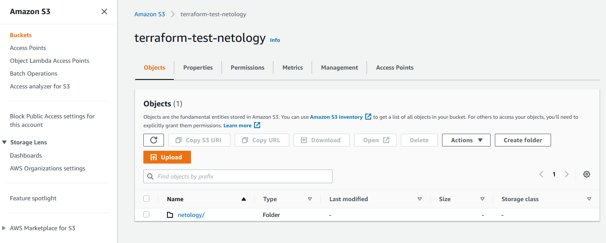
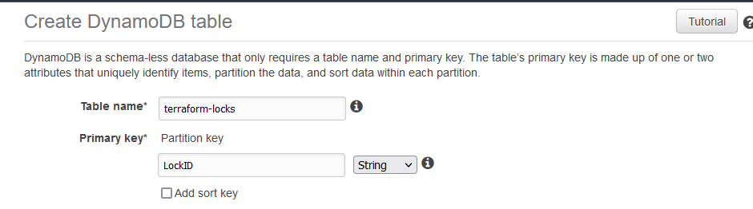
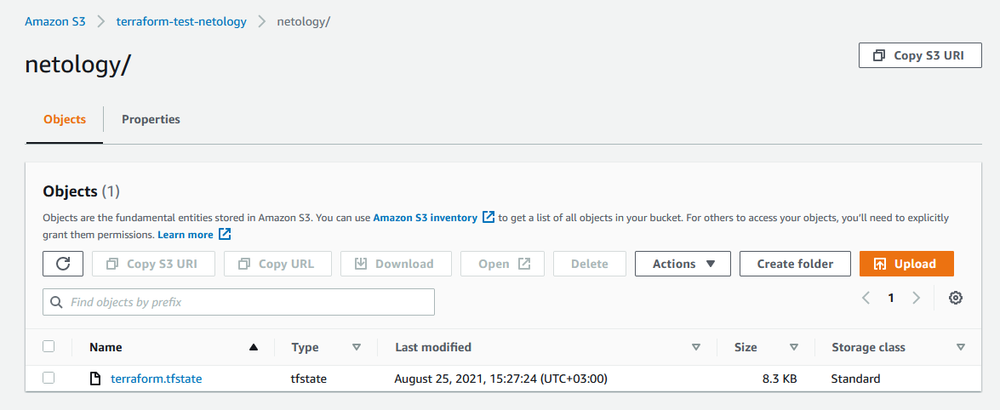
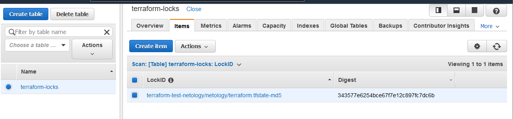
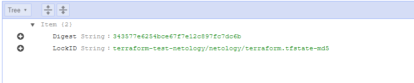

## Домашнее задание к занятию "7.3. Основы и принцип работы Терраформ"
___
**Задача 1. Создадим бэкэнд в S3 (необязательно, но крайне желательно).**

Если в рамках предыдущего задания у вас уже есть аккаунт AWS, то давайте продолжим знакомство со взаимодействием терраформа и aws.

1. Создайте s3 бакет, iam роль и пользователя от которого будет работать терраформ. 
   Можно создать отдельного пользователя, а можно использовать созданного в рамках предыдущего задания, 
   просто добавьте ему необходимы права, как описано здесь.
2. Зарегистрируйте бэкэнд в терраформ проекте как описано по ссылке выше.

___
**Выполнение ДЗ:**

1. Создание S3 бакета `terraform-test-netology` :

2. Создание `DynamoDB` с таблицей `terraform-locks` и `primary key` `LockID` для работы с Terraform:

3. Перенос (копия файлов) проекта из предыдущего ДЗ в новую папку и его инициализация:

**Файл main.tf:**

    provider "aws" {
      region = "eu-west-2"
    }
    
    data "aws_ami" "ubuntu" {
      most_recent = true
    
      filter {
        name   = "name"
        values = ["ubuntu/images/hvm-ssd/ubuntu-focal-20.04-amd64-server-*"]
      }
    
      filter {
        name   = "virtualization-type"
        values = ["hvm"]
      }
    
      owners = ["099720109477"] # Canonical
    }
    
    
    resource "aws_instance" "test" {
      ami           = data.aws_ami.ubuntu.id
      instance_type = "t3.micro"
    
      tags = {
        Name = "testubuntu"
      }
    
       credit_specification {
         cpu_credits = "unlimited"
      }
    }
    
    data "aws_caller_identity" "current" {}
    
    data "aws_region" "current" {}

Инициализация проекта:

        vagrant@vagrant:~/terraform/iac7_3$ terraform init
        
        Initializing the backend...
        
        Initializing provider plugins...
        - Reusing previous version of hashicorp/aws from the dependency lock file
        - Using previously-installed hashicorp/aws v3.55.0
        
        Terraform has been successfully initialized!

        vagrant@vagrant:~/terraform/iac7_3$ terraform apply
        
        aws_instance.test: Creating...
        aws_instance.test: Still creating... [10s elapsed]
        aws_instance.test: Creation complete after 15s [id=i-0425fa3f9de751745]
        
        Apply complete! Resources: 1 added, 0 changed, 0 destroyed.
        
        Outputs:
        
        account_id = "692810338857"
        caller_arn = "arn:aws:iam::692810338857:user/awsuser"
        caller_user = "AIDA2CTVW2IU67CF67QBP"
        private_ip = "172.31.13.41"
        region_name = "eu-west-2"
        subnet_id = "subnet-e8182181"

Автоматически создается файл `terraform.tfstate `

4. Добавление в файл конфигурации `main.tf` блока для переноса стейта в S3:

        terraform {
         backend "s3" {
           bucket         = "terraform-test-netology"
           encrypt        = true
           key            = "netology/terraform.tfstate"
           region         = "eu-west-2"
           dynamodb_table = "terraform-locks"
         }
        }

5. Переинициализация terraform:

        vagrant@vagrant:~/terraform/iac7_3$ terraform init
        
        Initializing the backend...
        Do you want to copy existing state to the new backend?
          Pre-existing state was found while migrating the previous "local" backend to the
          newly configured "s3" backend. No existing state was found in the newly
          configured "s3" backend. Do you want to copy this state to the new "s3"
          backend? Enter "yes" to copy and "no" to start with an empty state.
        
          Enter a value: yes
        
        Releasing state lock. This may take a few moments...
        
        Successfully configured the backend "s3"! Terraform will automatically
        use this backend unless the backend configuration changes.

6. Появление стейта в бакете S3 `terraform-test-netology`:

7. Добавление записи в таблицу `terraform-locks` DynamoDB:

**P/S. Возникли вопросы в процессе переноса стейта в S3:**

1. Первично удалил файл terraform.tfstate в локальной папке (решил сделать с чистого листа скопировав только конфигурацию из предыдущего ДЗ) и данный файл не появлялся пока не сделал `terraform apply`.
Так и должно быть? Не помогал ни `init`, ни `plan`.
   
2. После добавления блока с backend на S3 в п.4 - процесс `init` прошел успешно, а вот на `plan` была ошибка формата:

        -----------------------------------------------------
        2021-08-25T11:41:45.391Z [DEBUG] [aws-sdk-go] {"__type":"com.amazonaws.dynamodb.v20120810#ResourceNotFoundException","message":"Requested resource not found"}
        2021-08-25T11:41:45.391Z [DEBUG] [aws-sdk-go] DEBUG: Validate Response dynamodb/GetItem failed, attempt 0/5, error ResourceNotFoundException: Requested resource not found
        ╷
        │ Error: Error acquiring the state lock
        │
        │ Error message: 2 errors occurred:
        │       * ResourceNotFoundException: Requested resource not found
        │       * ResourceNotFoundException: Requested resource not found
        │
        │
        │
        │ Terraform acquires a state lock to protect the state from being written
        │ by multiple users at the same time. Please resolve the issue above and try
        │ again. For most commands, you can disable locking with the "-lock=false"

Судя по ней - ресурс для DynamoDB не был найден (я его изначально не создавал). Получается, что помимо S3 бакета, вручную ещё нужно создать и таблицу DynamoDB? 
Так как автоматически она не создается. Или я что-то упустил?

После того, как создал вручную - всё прошло отлично.
___
**Задача 2. Инициализируем проект и создаем воркспейсы.**

1. Выполните `terraform init`:
- если был создан бэкэнд в S3, то терраформ создат файл стейтов в S3 и запись в таблице dynamodb.
- иначе будет создан локальный файл со стейтами.
2. Создайте два воркспейса `stage` и `prod`.
3. В уже созданный `aws_instance` добавьте зависимость типа инстанса от вокспейса, 
   что бы в разных ворскспейсах использовались разные `instance_type`.
4. Добавим `count`. Для` stage` должен создаться один экземпляр ec2, а для `prod `два.
5. Создайте рядом еще один `aws_instance`, но теперь определите их количество при помощи `for_each`, а не `count`.
6. Что бы при изменении типа инстанса не возникло ситуации, когда не будет ни одного инстанса 
   добавьте параметр жизненного цикла `create_before_destroy = true` в один из рессурсов `aws_instance`.
7. При желании поэкспериментируйте с другими параметрами и рессурсами.

В виде результата работы пришлите:

- Вывод команды `terraform workspace list`.
- Вывод команды `terraform plan` для воркспейса `prod`.

___
**Выполнение ДЗ:**

