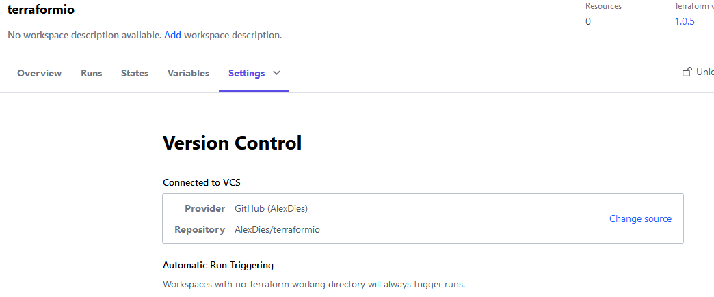
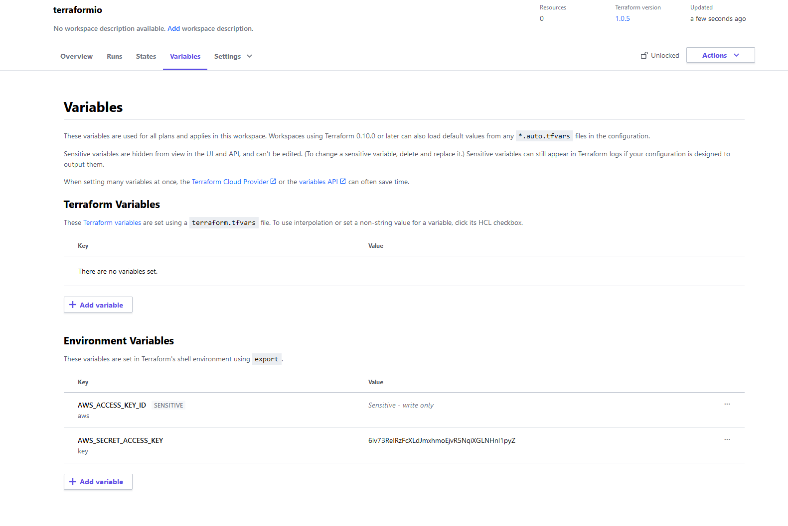
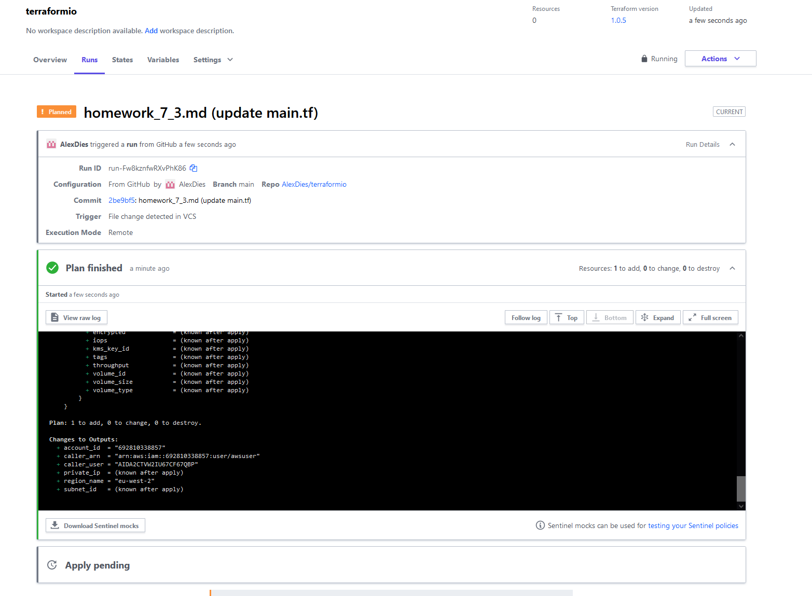
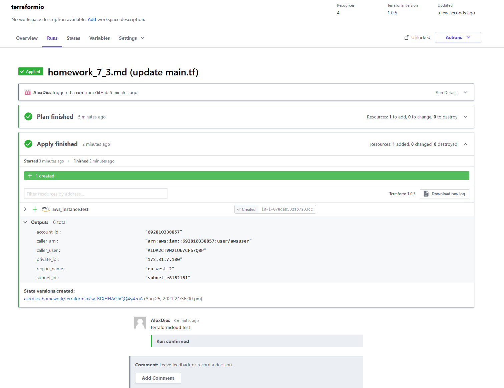
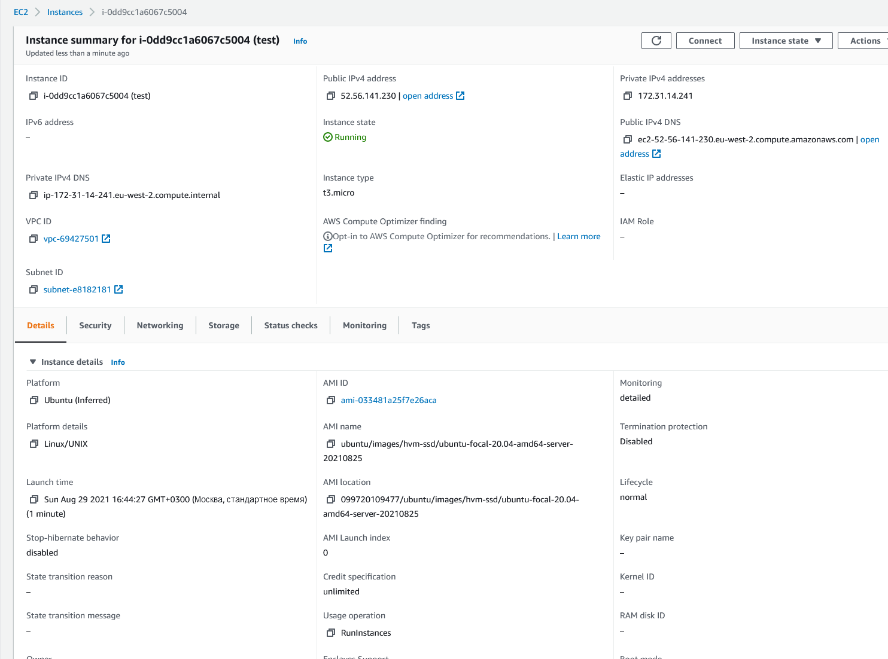

## Домашнее задание к занятию "7.4. Средства командной работы над инфраструктурой."
___
**Задача 1. Настроить terraform cloud (необязательно, но крайне желательно).**

В это задании предлагается познакомиться со средством командой работы над инфраструктурой предоставляемым разработчиками терраформа.

1. Зарегистрируйтесь на https://app.terraform.io/. (регистрация бесплатная и не требует использования платежных инструментов).
2. Создайте в своем github аккаунте (или другом хранилище репозиториев) отдельный репозиторий с конфигурационными файлами прошлых занятий (или воспользуйтесь любым простым конфигом).
3. Зарегистрируйте этот репозиторий в https://app.terraform.io/.
4. Выполните `plan` и `apply`.

В качестве результата задания приложите снимок экрана с успешным применением конфигурации.
___
**Выполнение ДЗ:**

1. Регистрация:

Регистрация прошла успешно
   
2. Создание отдельного репозитория:

Создал отдельный репозиторий AlexDies/terraformio (https://github.com/AlexDies/terraformio)

3. Регистрация репозитория в app.terraform.io:

Добавил свой аккаунт github с отдельным репозиторием AlexDies/terraformio

4. Добавление ключа и ID от AWS в окружении:

5. Создание плана `plan`:

6. Применение плана `apply`:

**P/S. Возникли следующие вопросы:**

1. Как добавить несколько воркспейсов, аналогично `terraform workspace new stage` и `terraform workspace new prod`?

Использовал файл `main.tf` из предыдущего ДЗ. Там использовалось несколько воркспейсов и при запуске плана в terraform cloud появляется ошибка:

      Terraform v1.0.5
      on linux_amd64
      Configuring remote state backend...
      Initializing Terraform configuration...
      ╷
      │ Error: Invalid index
      │ 
      │   on main.tf line 45, in resource "aws_instance" "test":
      │   45:   instance_type = local.web_instance_type_map[terraform.workspace]
      │     ├────────────────
      │     │ local.web_instance_type_map is object with 2 attributes
      │     │ terraform.workspace is "default"
      │ 
      │ The given key does not identify an element in this collection value.
      ╵
      ╷
      │ Error: Invalid index
      │ 
      │   on main.tf line 46, in resource "aws_instance" "test":
      │   46:   count = local.web_instance_count_map[terraform.workspace]
      │     ├────────────────
      │     │ local.web_instance_count_map is object with 2 attributes
      │     │ terraform.workspace is "default"
      │ 
      │ The given key does not identify an element in this collection value.

То есть в Cloud используется по умолчанию default воркспейс. Соответственно, данный конфиг не запустится пока не пропишешь эти воркспейсы.

Или используя Cloud тут подход другой будет? Если да, то как правильно решить такую задачу? (допустим, эти файлы конфигурации были использованы локально, а сейчас мы переходим на terraform cloud и они не запускаются)

2. Почему не добавляется файл стейта в S3? В конфигурационном файле следующий блок присутствует:
         
              terraform {
               backend "s3" {
                 bucket         = "terraform-test-netology"
                 encrypt        = true
                 key            = "netology/terraform.tfstate"
                 region         = "eu-west-2"
                 dynamodb_table = "terraform-locks"
               }
              }

Или Terraform Cloud хранит стейт файлы со своей стороны? Если так, то получается добавлять бэкэнд в S3 или иное место смысла нет в файл `main.tf`?

Сам инстанс при этом после `apply` создается успешно

___
**Задача 2. Написать серверный конфиг для атлантиса.**

Смысл задания – познакомиться с документацией о серверной конфигурации и конфигурации уровня репозитория.

Создай `server.yaml` который скажет атлантису:

1. Укажите, что атлантис должен работать только для репозиториев в вашем github (или любом другом) аккаунте.
2. На стороне клиентского конфига разрешите изменять `workflow`, то есть для каждого репозитория можно будет указать свои дополнительные команды.
3. В` workflow` используемом по-умолчанию сделайте так, что бы во время планирования не происходил `lock `состояния.

Создай `atlantis.yaml` который, если поместить в корень terraform проекта, скажет атлантису:

1. Надо запускать планирование и аплай для двух воркспейсов `stage `и `prod`.
2. Необходимо включить автопланирование при изменении любых файлов `*.tf`.

В качестве результата приложите ссылку на файлы `server.yaml` и `atlantis.yaml`.
___
**Выполнение ДЗ:**

**Серверная конфигурация `server.yaml`:**

1. Добавляем только свой репозиторий из github:

         repos:
         - id: github.com/AlexDies/homework
           apply_requirements: [approved]
           workflow: default
        
2. Добавить разрешение изменять `workflow` на стороне клиента:
Добавляем строчку `allowed_overrides: [workflow]`

         repos:
         - id: github.com/AlexDies/homework
           apply_requirements: [approved]
           workflow: default
           allowed_overrides: [workflow]
        
3. Заполнение `workflow`, чтобы во время планирования не происходил `lock `состояния:

Добавляем дефолтный workflows и изменяем его:
      
      repos:
      - id: github.com/AlexDies/homework
        apply_requirements: [approved]
        workflow: default
        allowed_overrides: [workflow]
      
      workflows:
        default:
          plan:
            steps:
            - init:
               extra_args: ["-lock=false"]
            - plan:
               extra_args: ["-lock=false"]
          apply:
            steps: 
            - apply:
               extra_args: ["-lock=false"]

**Конфигурация уровня репозитория `atlantis.yaml`:**

1. Добавим конфигурацию для двух воркспейсов `stage `и `prod`:

         version: 3
         projects:
         - dir: .
           workspace: stage
           terraform_version: v0.13.0
           workflow: default
         - dir: .
           workspace: prod
           terraform_version: v0.13.0  
           workflow: default
           
         workflows:
            default:
               plan:
                  steps:
                     - init: 
                        extra_args: ["-lock=false"]
                     - plan:
                        extra_args: ["-lock=false"]
               apply:
                  steps: 
                     - apply:
                        extra_args: ["-lock=false"]

2. Добавим автопланирование при изменении любых файлов `*.tf`:

         version: 3
         projects:
         - dir: .
           workspace: stage
           terraform_version: v0.13.0
           workflow: default
           autoplan:
             when_modified: ["*.tf*"]
         - dir: .
           workspace: prod
           terraform_version: v0.13.0  
           workflow: default
           autoplan:
             when_modified: ["*.tf*"]
           
         workflows:
            default:
               plan:
                  steps:
                     - init: 
                        extra_args: ["-lock=false"]
                     - plan:
                        extra_args: ["-lock=false"]
               apply:
                  steps: 
                     - apply:
                        extra_args: ["-lock=false"]

**Итоговые файлы конфигурации приведены в `atlantis.yaml` и в `server.yaml`**
___
**Задача 3. Знакомство с каталогом модулей.**

1. В каталоге модулей найдите официальный модуль от aws для создания `ec2 `инстансов.
2. Изучите как устроен модуль. Задумайтесь, будете ли в своем проекте использовать этот модуль или 
   непосредственно ресурс `aws_instance` без помощи модуля?
3. В рамках предпоследнего задания был создан ec2 при помощи ресурса `aws_instance`. Создайте аналогичный инстанс при помощи найденного модуля.

В качестве результата задания приложите ссылку на созданный блок конфигураций.
___
**Выполнение ДЗ:**

1. Найти официальный модуль от aws для создания `ec2 `инстансов:
   
Модуль ec2-instance найден

2. Изучить как устроен модуль. Будете ли в проекте использоваться этот модуль или непосредственно ресурс `aws_instance` без помощи модуля?
   
При изучении модуля видно, что у модуля есть несколько возможностей:

_1)Создать один инстанс EC2 (Single EC2 Instance)_

_2)Создать 3 инстанса EC2 (Multiple EC2 Instance)_

_3)Создать спот-инстанс EC2 (Spot EC2 Instance)_

Но в целом, насколько я понял, ресурс в модуле только 1, всё остальное это "дополнения"

В итоге, если речь идёт об одном инстансе EC2, то проще будет использовать непосредственно отдельный ресурс `aws_instance` без помощи модуля, так как ввод обязательных параметров всё равно необходим, 
что в целом почти равноценно и ручному созданию ресурса, но с конечными, нужными параметрами.

Данный модуль думаю, можно использовать, если необходимо получить множество разных output-значений из данного модуля. Тем самым используя его как "готовый шаблон" с нужными характеристиками.

**P/S. Какие ещё есть моменты, когда выгодно использовать модули для данного инстанса EC2, а не писать его вручную?**

3. В рамках предпоследнего задания был создан ec2 при помощи ресурса `aws_instance`. Создайте аналогичный инстанс при помощи найденного модуля.

Вместо блока ресурс, добавлен блок модуля EC2:

      module "ec2_instance" {
        source  = "terraform-aws-modules/ec2-instance/aws"
        version = "~> 3.0"
      
        name = "test"
      
        ami                    = data.aws_ami.ubuntu.id
        instance_type          = "t3.micro"
        monitoring             = true
      
        tags = {
          Terraform   = "true"
          Environment = "dev"
        }
      }

Планирование и запуск инстанса проходит успешно:
      
      vagrant@vagrant:~/terraform/iac7_4$ terraform apply
      
      Terraform used the selected providers to generate the following execution plan. Resource actions are indicated with the following
      symbols:
        + create
      
      Terraform will perform the following actions:
      
        # module.ec2_instance.aws_instance.this[0] will be created
      module.ec2_instance.aws_instance.this[0]: Creating...
      module.ec2_instance.aws_instance.this[0]: Still creating... [10s elapsed]
      module.ec2_instance.aws_instance.this[0]: Creation complete after 15s [id=i-0dd9cc1a6067c5004]
      
      Apply complete! Resources: 1 added, 0 changed, 0 destroyed.
      
      Outputs:
      
      account_id = "692810338857"
      caller_arn = "arn:aws:iam::692810338857:user/awsuser"
      caller_user = "AIDA2CTVW2IU67CF67QBP"
      region_name = "eu-west-2"

**Итоговый файл конфигурации записан в `main.tf`**