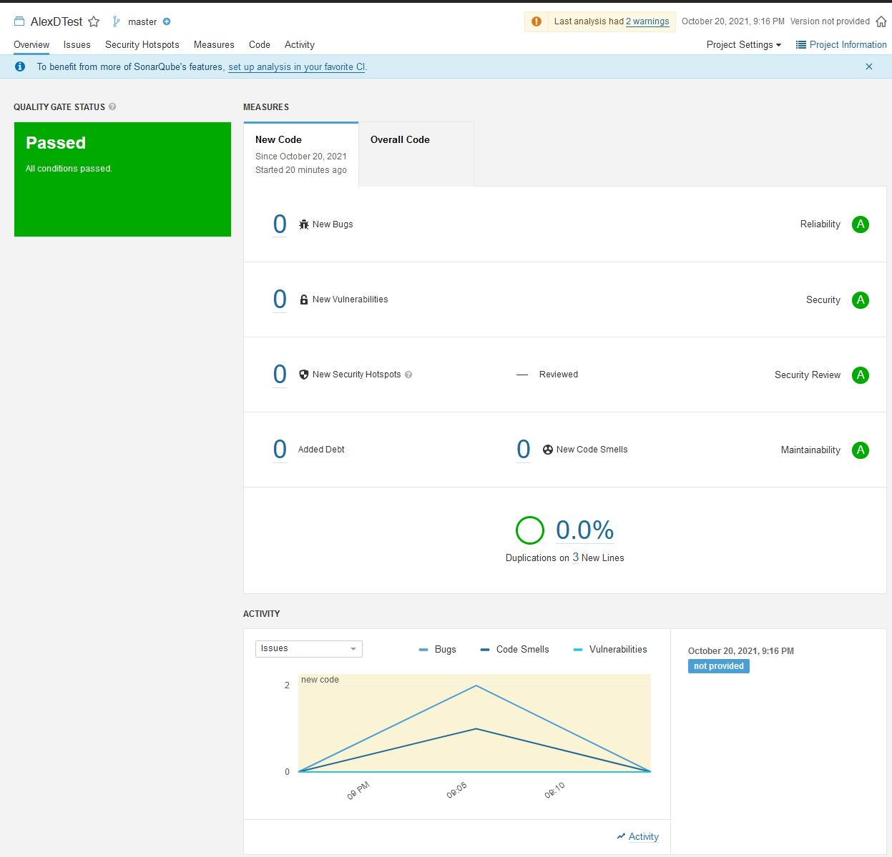

## Домашнее задание к занятию "09.03 CI\CD"
___
**Подготовка к выполнению**

1. Создаём 2 VM в yandex cloud со следующими параметрами: 2CPU 4RAM Centos7(остальное по минимальным требованиям)
2. Прописываем в [inventory](./infrastructure/inventory/cicd/hosts.yml) [playbook'a](./infrastructure/site.yml) созданные хосты
3. Добавляем в [files](./infrastructure/files/) файл со своим публичным ключом (id_rsa.pub). Если ключ называется иначе - найдите таску в плейбуке, которая использует id_rsa.pub имя и исправьте на своё
4. Запускаем playbook, ожидаем успешного завершения
5. Проверяем готовность Sonarqube через [браузер](http://localhost:9000)
6. Заходим под admin\admin, меняем пароль на свой
7.  Проверяем готовность Nexus через [бразуер](http://localhost:8081)
8. Подключаемся под admin\admin123, меняем пароль, сохраняем анонимный доступ
___
## Знакомоство с SonarQube

### Основная часть
1. Создаём новый проект, название произвольное
2. Скачиваем пакет sonar-scanner, который нам предлагает скачать сам sonarqube
3. Делаем так, чтобы binary был доступен через вызов в shell (или меняем переменную PATH или любой другой удобный вам способ)
4. Проверяем `sonar-scanner --version`
5. Запускаем анализатор против кода из директории [example](./example) с дополнительным ключом `-Dsonar.coverage.exclusions=fail.py`
6. Смотрим результат в интерфейсе
7. Исправляем ошибки, которые он выявил(включая warnings)
8. Запускаем анализатор повторно - проверяем, что QG пройдены успешно
9. Делаем скриншот успешного прохождения анализа, прикладываем к решению ДЗ
___
## Знакомство с Nexus

### Основная часть

1. В репозиторий `maven-public` загружаем артефакт с GAV параметрами:
   1. groupId: netology
   2. artifactId: java
   3. version: 8_282
   4. classifier: distrib
   5. type: tar.gz
2. В него же загружаем такой же артефакт, но с version: 8_102
3. Проверяем, что все файлы загрузились успешно
4. В ответе присылаем файл `maven-metadata.xml` для этого артефекта
___
### Знакомство с Maven

### Подготовка к выполнению

1. Скачиваем дистрибутив с [maven](https://maven.apache.org/download.cgi)
2. Разархивируем, делаем так, чтобы binary был доступен через вызов в shell (или меняем переменную PATH или любой другой удобный вам способ)
3. Удаляем из `apache-maven-<version>/conf/settings.xml` упоминание о правиле, отвергающем http соединение( раздел mirrors->id: my-repository-http-unblocker)
4. Проверяем `mvn --version`
5. Забираем директорию [mvn](./mvn) с pom

### Основная часть

1. Меняем в `pom.xml` блок с зависимостями под наш артефакт из первого пункта задания для Nexus (java с версией 8_282)
2. Запускаем команду `mvn package` в директории с `pom.xml`, ожидаем успешного окончания
3. Проверяем директорию `~/.m2/repository/`, находим наш артефакт
4. В ответе присылаем исправленный файл `pom.xml`

___
## Выполнение ДЗ:

**Подготовка:**

- Создаем 2 VM в yandex cloud
- Редактируем host.yml в роли - указываем статические IP-адреса машин и юзера
- В папку files добавляем id_rsa.pub с ПК
- Запускаем `ansible-playbook -i inventory/cicd/hosts.yml site.yml`:
  
         PLAY RECAP ******************************************************************************
         nexus-01                   : ok=17   changed=15   unreachable=0    failed=0    skipped=2    rescued=0    ignored=0   
         sonar-01                   : ok=34   changed=16   unreachable=0    failed=0    skipped=1    rescued=0    ignored=0   

- Подключаемся к Nexus - меняем пароль
- Подключаемся к Sonarqube - меняем пароль

Инфраструктура готова
___
## SonarQube

1. Создаем новый проект AlexDTest
2. Скачиваем пакет sonar-scanner 
3. Добавляем переменную в PATH: `export PATH=$PATH:/home/alexd/sonar/bin`
4. Проверяем версию сонара:
   
         alexd@DESKTOP-92FN9PG:~/sonar$ sonar-scanner --version
         INFO: Scanner configuration file: /home/alexd/sonar/conf/sonar-scanner.properties
         INFO: Project root configuration file: NONE
         INFO: SonarScanner 4.6.2.2472
         INFO: Java 11.0.11 AdoptOpenJDK (64-bit)
         INFO: Linux 5.4.72-microsoft-standard-WSL2 amd64
5. Запускаем анализатор против кода из example с дополнительным ключом `-Dsonar.coverage.exclusions=fail.py` 

         alexd@DESKTOP-92FN9PG:/mnt/c/Users/AlexD/Documents/VSCodeProject/AnsiblePlaybook/AnsiblePlaybook/homework_9_3(CI,CD process)/example$ sonar-scanner   -Dsonar.projectKey=AlexDTest   -Dsonar.sources=.   -Dsonar.host.url=http://178.154.222.25:9000   -Dsonar.login=0ed89293a6ebf7288c2f02e36fe5a9594ddb760e -Dsonar.coverage.exclusions=fail.py
         INFO: Scanner configuration file: /home/alexd/sonar/conf/sonar-scanner.properties
         INFO: Project root configuration file: NONE
         INFO: SonarScanner 4.6.2.2472
         INFO: Java 11.0.11 AdoptOpenJDK (64-bit)
         INFO: Linux 5.4.72-microsoft-standard-WSL2 amd64
         INFO: User cache: /home/alexd/.sonar/cache
         INFO: Scanner configuration file: /home/alexd/sonar/conf/sonar-scanner.properties
         INFO: Project root configuration file: NONE
         INFO: Analyzing on SonarQube server 9.1.0
         INFO: Default locale: "en", source code encoding: "UTF-8" (analysis is platform dependent)
         INFO: Load global settings
         INFO: Load global settings (done) | time=73ms
         INFO: Server id: 9CFC3560-AXyZ39G2O-GTy_7Ahicj
         INFO: User cache: /home/alexd/.sonar/cache
         INFO: Load/download plugins
         INFO: Load plugins index
         INFO: Load plugins index (done) | time=45ms
         INFO: Load/download plugins (done) | time=97ms
         INFO: Process project properties
         INFO: Process project properties (done) | time=6ms
         INFO: Execute project builders
         INFO: Execute project builders (done) | time=1ms
         INFO: Project key: AlexDTest
         INFO: Base dir: /mnt/c/Users/AlexD/Documents/VSCodeProject/AnsiblePlaybook/AnsiblePlaybook/homework_9_3(CI,CD process)/example
         INFO: Working dir: /mnt/c/Users/AlexD/Documents/VSCodeProject/AnsiblePlaybook/AnsiblePlaybook/homework_9_3(CI,CD process)/example/.scannerwork
         INFO: Load project settings for component key: 'AlexDTest'
         INFO: Load project settings for component key: 'AlexDTest' (done) | time=25ms
         INFO: Load quality profiles
         INFO: Load quality profiles (done) | time=64ms
         INFO: Load active rules
         INFO: Load active rules (done) | time=1740ms
         INFO: Indexing files...
         INFO: Project configuration:
         INFO:   Excluded sources for coverage: fail.py
         WARN: Thread[JGit-FileStoreAttributeReader-1,5,main]: got smaller file timestamp on /mnt/c (C:\), /mnt/c/Users/AlexD/Documents/VSCodeProject/AnsiblePlaybook/AnsiblePlaybook/.git: 2021-10-20T18:07:57Z < 2021-10-20T18:07:57.953388Z. Aborting measurement at resolution PT0.046612S.
         INFO: 1 file indexed
         INFO: 0 files ignored because of scm ignore settings
         INFO: Quality profile for py: Sonar way
         INFO: ------------- Run sensors on module AlexDTest
         INFO: Load metrics repository
         INFO: Load metrics repository (done) | time=32ms
         INFO: Sensor Python Sensor [python]
         WARN: Your code is analyzed as compatible with python 2 and 3 by default. This will prevent the detection of issues specific to python 2 or python 3. You can get a more precise analysis by setting a python version in your configuration via the parameter "sonar.python.version"
         INFO: Starting global symbols computation
         INFO: 1 source file to be analyzed
         INFO: Load project repositories
         INFO: Load project repositories (done) | time=24ms
         INFO: 1/1 source file has been analyzed
         INFO: Starting rules execution
         INFO: 1 source file to be analyzed
         INFO: 1/1 source file has been analyzed
         INFO: Sensor Python Sensor [python] (done) | time=608ms
         INFO: Sensor Cobertura Sensor for Python coverage [python]
         INFO: Sensor Cobertura Sensor for Python coverage [python] (done) | time=28ms
         INFO: Sensor PythonXUnitSensor [python]
         INFO: Sensor PythonXUnitSensor [python] (done) | time=19ms
         INFO: Sensor CSS Rules [cssfamily]
         INFO: No CSS, PHP, HTML or VueJS files are found in the project. CSS analysis is skipped.
         INFO: Sensor CSS Rules [cssfamily] (done) | time=0ms
         INFO: Sensor JaCoCo XML Report Importer [jacoco]
         INFO: 'sonar.coverage.jacoco.xmlReportPaths' is not defined. Using default locations: target/site/jacoco/jacoco.xml,target/site/jacoco-it/jacoco.xml,build/reports/jacoco/test/jacocoTestReport.xml
         INFO: No report imported, no coverage information will be imported by JaCoCo XML Report Importer
         INFO: Sensor JaCoCo XML Report Importer [jacoco] (done) | time=3ms
         INFO: Sensor C# Project Type Information [csharp]
         INFO: Sensor C# Project Type Information [csharp] (done) | time=1ms
         INFO: Sensor C# Analysis Log [csharp]
         INFO: Sensor C# Analysis Log [csharp] (done) | time=12ms
         INFO: Sensor C# Properties [csharp]
         INFO: Sensor C# Properties [csharp] (done) | time=0ms
         INFO: Sensor JavaXmlSensor [java]
         INFO: Sensor JavaXmlSensor [java] (done) | time=1ms
         INFO: Sensor HTML [web]
         INFO: Sensor HTML [web] (done) | time=2ms
         INFO: Sensor VB.NET Project Type Information [vbnet]
         INFO: Sensor VB.NET Project Type Information [vbnet] (done) | time=0ms
         INFO: Sensor VB.NET Analysis Log [vbnet]
         INFO: Sensor VB.NET Analysis Log [vbnet] (done) | time=11ms
         INFO: Sensor VB.NET Properties [vbnet]
         INFO: Sensor VB.NET Properties [vbnet] (done) | time=0ms
         INFO: ------------- Run sensors on project
         INFO: Sensor Zero Coverage Sensor
         INFO: Sensor Zero Coverage Sensor (done) | time=1ms
         INFO: SCM Publisher SCM provider for this project is: git
         INFO: SCM Publisher 1 source file to be analyzed
         INFO: SCM Publisher 1/1 source file have been analyzed (done) | time=453ms
         INFO: CPD Executor Calculating CPD for 1 file
         INFO: CPD Executor CPD calculation finished (done) | time=13ms
         INFO: Analysis report generated in 106ms, dir size=103.1 kB
         INFO: Analysis report compressed in 229ms, zip size=14.3 kB
         INFO: Analysis report uploaded in 39ms
         INFO: ANALYSIS SUCCESSFUL, you can browse http://178.154.222.25:9000/dashboard?id=AlexDTest
         INFO: Note that you will be able to access the updated dashboard once the server has processed the submitted analysis report
         INFO: More about the report processing at http://178.154.222.25:9000/api/ce/task?id=AXye43EZzf6IFc99Cfrj
         INFO: Analysis total time: 5.008 s
         INFO: ------------------------------------------------------------------------
         INFO: EXECUTION SUCCESS
         INFO: ------------------------------------------------------------------------
         INFO: Total time: 5.752s
         INFO: Final Memory: 8M/37M
         INFO: ------------------------------------------------------------------------
6. Проверяем WEB-интерфейс. Найдено 2 bugs и 1 Code Smell
7. Исправление ошибок:

         index = 0
         def increment(index):
            index += 1
            return index
         def get_square(numb):
            return numb*numb
         def print_numb(numb):
            print("Number is {}".format(numb))

         while (index < 10):
            index = increment(index)
            print(get_square(index))
8. Повторный запуск и проверка что тест пройден успешно:

На этом данная часть задания закончена!
___
## Nexus

1. Загружаем файл с указанными параметрами в `maven-public`
2. Загружаем аналогичный файл, но версии 8_102
3. Оба файла загружены успешно!
4. Файл `maven-metadata.xml` во вложении
___
## Maven

Подготовка:

1. Добавление пути в PATH: `export PATH=$PATH:/home/alexd/maven/bin`
2. Удаляем из `apache-maven-<version>/conf/settings.xml` упоминание о правиле, отвергающем http соединение( раздел mirrors->id: my-repository-http-unblocker)
Удаляем блок:

         <mirror>
            <id>maven-default-http-blocker</id>
            <mirrorOf>external:http:*</mirrorOf>
            <name>Pseudo repository to mirror external repositories initially using HTTP.</name>
            <url>http://0.0.0.0/</url>
            <blocked>true</blocked>
         </mirror>
      </mirrors>

3. Проверяем `mvn --version`:

         alexd@DESKTOP-92FN9PG:~/maven$ mvn --version
         Apache Maven 3.8.3 (ff8e977a158738155dc465c6a97ffaf31982d739)
         Maven home: /home/alexd/maven/apache-maven-3.8.3
         Java version: 1.8.0_292, vendor: Private Build, runtime: /usr/lib/jvm/java-8-openjdk-amd64/jre
         Default locale: en, platform encoding: UTF-8
         OS name: "linux", version: "5.4.72-microsoft-standard-wsl2", arch: "amd64", family: "unix"
4. Подготоваливаем `pom-файл`.

Основная часть:

1. Редактируем `pom.xml` с зависимостями под наш артефакт из первого пункта задания для Nexus (java с версией 8_282)

         <project xmlns="http://maven.apache.org/POM/4.0.0" xmlns:xsi="http://www.w3.org/2001/XMLSchema-instance"
         xsi:schemaLocation="http://maven.apache.org/POM/4.0.0 http://maven.apache.org/xsd/maven-4.0.0.xsd">
         <modelVersion>4.0.0</modelVersion>
         
         <groupId>com.netology.app</groupId>
         <artifactId>simple-app</artifactId>
         <version>1.0-SNAPSHOT</version>
            <repositories>
            <repository>
               <id>my-repo</id>
               <name>maven-public</name>
               <url>http://130.193.36.78:8081/repository/maven-releases/</url>
            </repository>
         </repositories>
         <dependencies>
            <dependency>
               <groupId>netology</groupId>
               <artifactId>java</artifactId>
               <version>8_282</version>
               <classifier>distrib</classifier>
               <type>tar.gz</type>
            </dependency>
         </dependencies>
         </project>

2. Запуск команды `mvn package` в директории с `pom.xml`:

         alexd@DESKTOP-92FN9PG:~/maven/apache-maven-3.8.3$ mvn package
         [INFO] Scanning for projects...
         [INFO] 
         [INFO] --------------------< com.netology.app:simple-app >---------------------
         [INFO] Building simple-app 1.0-SNAPSHOT
         [INFO] --------------------------------[ jar ]---------------------------------        
         Downloading from central: https://repo.maven.apache.org/maven2/org/apache/maven/plugins/maven-resources-plugin/2.6/maven-resources-plugin-2.6.pom
         <МНОГО ЛОГА>
         [INFO]
         [INFO] --- maven-resources-plugin:2.6:resources (default-resources) @ simple-app ---   

         [WARNING] JAR will be empty - no content was marked for inclusion!
         [INFO] Building jar: /home/alexd/maven/apache-maven-3.8.3/target/simple-app-1.0-SNAPSHOT.jar
         [INFO] ------------------------------------------------------------------------        
         [INFO] BUILD SUCCESS
         [INFO] ------------------------------------------------------------------------        
         [INFO] Total time:  20.762 s
         [INFO] Finished at: 2021-10-20T23:22:21+03:00
         [INFO] ------------------------------------------------------------------------ 

3. Проверяем дирекотрию `~/.m2/repository/`:

         alexd@DESKTOP-92FN9PG:~/.m2/repository/netology/java/8_282$ ls
         _remote.repositories       java-8_282-distrib.tar.gz.sha1
         java-8_282-distrib.tar.gz  java-8_282.pom.lastUpdated

4. Исправленный файл `pom.xml` во вложении.

